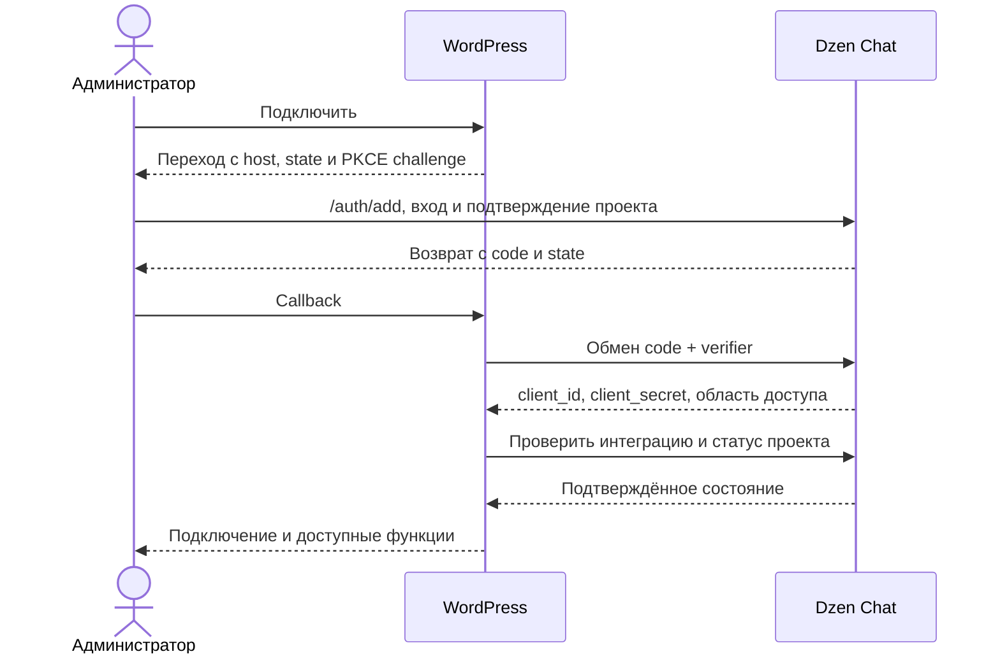

# Task: Плагин Dzen Chat для WordPress

Дата: 2026-09-09. Состояние: **клиент WordPress 0.1.0 реализован под контракт API**.
Серверная реализация и совместная приёмка остаются отдельным этапом. История,
источники и скрытие реализуются по уточнению пользователя без ожидания API.

## Goal

Администратор WordPress подключает сайт к проекту Dzen Chat через подтверждение
на `chat.dzen.dev`, управляет виджетами и триггерами страниц, видит историю
диалогов, состояние индекса и дополнительных источников. Изменения публичных
материалов сайта автоматически доходят до индекса, а ограничения проекта
отображаются в WordPress и соблюдаются сервисом.

Результат реализации — устанавливаемый ZIP плагина, код и проверки в
`git@github.com:dzenplatform/dzen-wordpress.git`, локально в
`/Users/xen/Dev/dzen/wordpress`.

## Context

Проверен код основного checkout `/Users/xen/Dev/dzen/chat` на 2026-09-09:

- `chat/routes.py`: публичный `POST /api/update`, публичный виджет и маршруты
  административного интерфейса проекта.
- `chat/views/api/views.py`: подпись обновления, одноразовый nonce, ограничения
  запросов, проверка источников клиента и постановка `crawl_page_task` в очередь.
- `chat/models/data.py`: `ApiClient`, `Source`, `WidgetIntegration`, `Page`,
  `Chat`, `ChatMsg`, привязки к проекту и источникам.
- `chat/models/project.py`: проект и роли `owner`/`member`.
- `chat/views/projects/workspaces.py`: создание проекта и источников.
- `chat/views/projects/views.py`: создание API-клиента и настройки источников.
- `chat/views/projects/chats.py`: списки и детали истории в интерфейсе Dzen Chat.
- [Актуальный контракт интеграции и оставшиеся требования](../contracts/dzen-chat-api.md).
- WordPress API: `admin_url()`, `home_url()`, Options API,
  `wp_after_insert_post`, `transition_post_status`, `before_delete_post`, WP-Cron.

## Current Behavior

Ниже исходное состояние на момент постановки. Состояние клиента после реализации
и выполненные проверки описаны в [отчёте](../verification/2026-09-09-wordpress-client.md).

| Область | Что существует | Чего не хватает для плагина |
| --- | --- | --- |
| WordPress | Указанный репозиторий был пуст; `origin` настроен | Код, административные страницы, сборка и проверки |
| Подключение | API-клиенты проекта с `client_id`, зашифрованным секретом и `is_active` | `/auth/add`, согласие, одноразовый обмен и отдельная запись интеграции |
| Индекс | `POST /api/update` проверяет подпись и ставит URL на переобход | Явное удаление, версии событий, подтверждение результата, список документов |
| Виджеты и история | Модели и административные HTML-маршруты | API для серверного клиента WordPress с ограниченными правами |
| Триггеры | `Source.enable_triggers`, `Page.has_triggers`, настройки виджета | Отдельная политика включения триггеров конкретной страницы |
| Оплата | В просмотренной модели и обработчике API нет статуса оплаты проекта | Авторитетный статус проекта и правила разрешённых операций |

`202 queued` подтверждает приём работы, а не завершённую индексацию.
`ApiClient.is_active`, пауза источника и блокировка проекта — разные состояния.
Текущий `/api/update` подписывает поля URL-запроса; эту подпись нельзя просто
перенести на произвольные методы управления. Работа production и локального UI
в этой постановке не проверялась.

## Target Shape

### 1. Границы первой версии

Предлагается один проект Dzen Chat на один сайт WordPress; у проекта может быть
несколько независимо отзываемых интеграций. Первая версия ориентирована на
обычную установку WordPress. Поддержку multisite следует подтвердить отдельной
матрицей проверок; сетевое подключение всех сайтов не включается автоматически.

Подтверждённый пользователем охват — только публичные `page` и `post`.
Товары относятся к будущей отдельной интеграции. Черновики, приватные и защищённые
паролем материалы, другие типы записей, ревизии и автосохранения не отправляются.

### 2. Подключение

1. Администратор с `manage_options` нажимает «Подключить Dzen Chat».
   POST защищён WordPress nonce. Сервер WP создаёт случайный `state` и PKCE
   verifier, связывает их с текущим пользователем, сессией и установкой сайта.
2. Браузер открывает `https://chat.dzen.dev/auth/add` с `host`,
   `type=wordpress`, `site_url`, `redirect_uri`, `state`, `code_challenge`
   и `code_challenge_method=S256`. `host` берётся из настроенного `home_url()`,
   не из произвольного заголовка Host. Callback строится через `admin_url()`:
   `admin-post.php?action=dzen_chat_authorize`.
3. Dzen Chat сохраняет запрос на время входа. После входа показывает домен,
   WordPress и область доступа; предлагает существующий доступный проект или
   новый. Подтверждение выполняется POST с CSRF-защитой. Обычный GET не создаёт
   проект, источник или API-клиента.
4. Для нового проекта сервер создаёт название по `host`, владельца и источник
   `site_url`. Для существующего — находит подходящий источник этого сайта или
   добавляет его без дубликата. Эти технические действия не требуют отдельных
   экранов. Начальная индексация запускается после успешного подключения.
5. Сервер возвращает на точно проверенный callback `code` и `state`.
   Код имеет короткий срок действия; предлагается 5 минут. Его хеш хранится на
   сервере вместе с проектом, типом, сайтом, callback и PKCE challenge.
6. WP проверяет `state`, сессию и право администратора, затем серверным POST
   обменивает код с verifier на `client_id` и `client_secret`. Погашение кода
   атомарно: из двух конкурентных запросов успешен максимум один.
7. WP сохраняет учётные данные и запрашивает состояние интеграции. «Подключено»
   появляется только после проверки проекта, сайта и прав в ответе. Если проект
   ограничен, показываются факт подключения и отдельное ограничение.

Callback разрешён только на HTTPS того же origin, что и зарегистрированный сайт,
по ожидаемому пути WordPress; учитываются подпапки. Домен и порт нормализуются,
wildcard и произвольное перенаправление запрещены. Раздельные домены публичного
сайта и админки требуют отдельного решения. В production приватные адреса и
опасные перенаправления crawler запрещены. Локальная тестовая конфигурация
задаётся отдельно, с проверкой TLS. Основание для точного callback и PKCE —
[RFC 9700](https://www.rfc-editor.org/rfc/rfc9700.html).

Callback не подключает внешние ресурсы, имеет `Cache-Control: no-store` и
`Referrer-Policy: no-referrer`; после обработки URL очищается редиректом.
Code, verifier и секрет не попадают в журналы приложения и аналитику. Требование
к маскированию query callback отдельно проверяется на тестовом веб-сервере.
При отказе, истечении или потере ответа обмена показывается явный результат и
действие повторного подключения. Повторной выдачи погашенного кода нет;
незавершённый клиент отзывается при повторном подключении этой установки.

### 3. Хранение в WordPress

- Несекретные настройки и идентификаторы — отдельные per-site options.
  `client_id` не является паролем, но доступен только серверному коду и экрану
  администратора. Секрет не возвращается через REST, HTML или JavaScript.
- `client_secret` — зашифрованная per-site option, созданная с `autoload=false`.
  Предлагается authenticated encryption через `sodium_crypto_secretbox`, со
  случайным nonce для каждой записи и версией формата шифротекста. Это решение
  плагина; Options API сам не выполняет шифрование.
- Ключ шифрования выводится через HKDF из сильных ключей `AUTH_KEY` и
  `SECURE_AUTH_KEY` в конфигурации WP, с отдельным назначением Dzen Chat и UUID
  установки. Проверяются доступность sodium и настоящие ключи конфигурации;
  при нарушении подключение останавливается с понятной ошибкой. Самостоятельно
  править `wp-config.php` или хранить ключ рядом с шифротекстом не нужно.
- Использование только `wp_salt()` не гарантирует, что секретный материал
  находится вне БД: WordPress допускает также ключи в базе. Предлагаемое
  шифрование защищает отдельную копию БД при наличии ключей вне неё; оно не
  защищает от плагина, выполняющего PHP в той же установке.
- При смене ключей WP требуется повторное подключение. Смена адреса или
  клонирование сайта останавливает отправку до повторного подтверждения нового
  сайта; копия очереди не должна работать от имени исходной установки.
- Короткоживущие данные подключения хранятся отдельно, с TTL и проверкой срока
  при каждом чтении. Политика страницы — post meta; очередь — отдельная таблица.
- «Отключить интеграцию» отзывает выделенного клиента и удаляет локальные
  credentials. При недоступном сервисе отзыв помечается незавершённым, доступно
  повторение или отзыв в Dzen Chat. Деактивация плагина прекращает вставку виджета
  и фоновые задания, сохраняя настройки. Удаление плагина очищает его локальные
  секреты и данные; удаление проекта и источников в Dzen Chat не выполняется.

Основания: [Options API](https://developer.wordpress.org/reference/functions/add_option/),
[wp_salt](https://developer.wordpress.org/reference/functions/wp_salt/),
[PHP sodium](https://www.php.net/manual/en/function.sodium-crypto-secretbox.php).
Проверка роли обязательна вместе с nonce: [WordPress nonces](https://developer.wordpress.org/plugins/security/nonces/).

### 4. Административный интерфейс

| Раздел Dzen Chat | Поведение |
| --- | --- |
| Обзор | Проект, состояние подключения, ограничения, дата последней проверки, очередь и ошибки, кнопки проверки/повторного подключения/отключения |
| Виджеты | Список доступных сайту виджетов, создание, выбор источников в разрешённой области, название/приветствие/оформление, включение, правила размещения |
| Страницы и триггеры | Поиск страницы, статус индекса, наследование/включение/выключение триггеров и эффективное состояние с причиной |
| Диалоги | Просмотр, поиск, даты, фильтр виджета и видимости, сообщения/оценки; источники внутри WP и по внешней ссылке; скрыть/вернуть в список |
| Источники | Основной сайт и разрешённые дополнительные источники: состояние, ошибки, счётчики, последнее и следующее обновление, ссылка на настройки в Dzen Chat |

Это собственные экраны WP с серверным обращением к API, а не встраивание админки
Dzen Chat через iframe. Настройки виджетов сохраняются в Dzen Chat; локально
хранится выбор размещения и безопасная конфигурация для вставки. Предлагается
один выбранный виджет на страницу с явным приоритетом правил; другие виджеты
можно создать и назначить другим страницам. Существующий вставленный вручную
код должен быть выявлен при установке, чтобы администратор убрал дубликат.

История остаётся на сервере Dzen Chat; удаление и правка сообщений запрещены,
поскольку это биллинговая история. Скрытие — общее обратимое состояние проекта,
не влияющее на переписку, токены и оплату. Скрытые чаты доступны по фильтру и
прямой карточке. Серверная админка и API описаны в
[тикете #14](https://github.com/xen/dzen.chat/issues/14).

Триггеры — существующие триггеры Dzen Chat, связанные со страницей. Выключение
триггеров не отключает весь виджет и не меняет автоматически настройки
предлагаемых вопросов (`suggestions_enabled`). Локальное изменение политики
имеет состояния «ожидает применения»/«применено»/«ошибка». Она должна сохраняться
до появления документа в индексе и соблюдаться публичным виджетом.

### 5. Синхронизация контента

Хуки фиксируют событие в устойчивой очереди, не выполняя HTTP-запрос во время
сохранения редактором. Финальные данные берутся после сохранения материала,
таксономий и метаданных; учитываются редактор блоков, Classic Editor, REST,
WP-CLI и публикация по расписанию. Основа —
[wp_after_insert_post](https://developer.wordpress.org/reference/hooks/wp_after_insert_post/).

| Событие | Действие |
| --- | --- |
| Первая публикация или обновление публичного материала | `upsert` с текущим каноническим URL |
| Смена slug, родительской страницы или структуры постоянных ссылок | Удаление прежнего URL и обработка нового; массовая смена запускает сверку |
| Переход в draft/private/password-protected, корзина, окончательное удаление | Явное `delete` для ранее синхронизированного материала |
| Восстановление из корзины | `upsert` только после проверки текущей публичности |
| Исключение страницы или записи из настроек | Удаление уже синхронизированного документа и сохранение исключения |
| Автосохранение или ревизия | События индекса не создаются |
| Первое подключение | Пакетная сверка существующих публичных материалов с прогрессом |

Сверка и события этой интеграции перечисляют только публичные `page`/`post`.
Новый источник WordPress не должен обходить это ограничение через общий sitemap
с товарами или переходы по ссылкам. Уже существующие отдельные источники проекта
не очищаются и не перенастраиваются автоматически.

Идентичность документа — `(integration_id, external_id)`, где `external_id`
стабилен для записи WP. У события есть UUID, монотонная версия объекта, действие,
URL и прежний URL. Одной даты `post_modified` недостаточно для порядка изменений.
Задача учитывает последнее состояние записи; повтор и перестановка доставки
не должны восстанавливать удалённый материал. Tombstone должен учитываться
также обычным обходом источника, иначе crawler вернёт исключённую страницу.

Таблица очереди хранит попытки, следующую дату, безопасную ошибку и
`operation_id`; отдельное состояние объекта хранит последний подтверждённый URL
и версию. Состояния: ожидает, отправляется, принято сервисом, завершено,
ожидает восстановления доступа, ошибка. Ошибка записи в очередь видна
администратору; сверка восстанавливает пропущенное событие.

Предлагается WP-Cron с ограниченным размером пакета и блокировкой worker.
Для timeout/429/временных 5xx — ограниченные повторные попытки с тем же UUID и
телом, учётом `Retry-After`, журналом и конечной ошибкой. После приёма `202`
проверяется операция, событие не создаётся заново. Для 401/403 требуется явное
восстановление доступа, для невалидных данных — исправление. События удаления
сохраняются при остановке отправки. Это явная предлагаемая политика очереди,
а не скрытое подавление ошибок.

WP-Cron зависит от посещений сайта, поэтому без внешнего планировщика нельзя
обещать фиксированное время обновления. В настройках показываются задержка и
последний запуск. Для сайтов без трафика документируется запуск WP-Cron
планировщиком хостинга. [Документация WP-Cron](https://developer.wordpress.org/plugins/cron/).

### 6. Активность проекта и границы данных

Сервер возвращает отдельно состояние клиента, проекта, источника и список
разрешённых операций. WP показывает причину ограничения и переход к действию
в Dzen Chat. Пауза индексации не изображается успешной синхронизацией.
Правила оплаты определяет сервис; плагин не рассчитывает задолженность.

Предлагается при блокировке остановить новые `upsert` и выдачу ответов виджетом;
чтение доступного статуса и удаление контента ради отзыва публикации разрешать
по отдельным серверным правам. Политика удаления/чтения при блокировке и источник
статуса оплаты требуют согласования в серверной задаче.

WP кэширует только публичную конфигурацию и состояние с ограниченным сроком,
предлагается 5 минут. Неизвестный или просроченный статус показывается явно.
Сервис проверяет ограничения при выдаче ответов даже для виджета на странице
из внешнего кэша. Административные ключи никогда не передаются виджету.

Доступ к данным определяется интеграцией: её сайт, виджеты и соответствующие
диалоги. Наблюдение дополнительных источников предоставляется отдельным scope
с явным перечислением при согласии; пароли и параметры подключения источников
не возвращаются. Плагин не копирует полную историю переписки в БД WP и не
передаёт имена/email пользователей WordPress по умолчанию.

### 7. Структура плагина

Предлагаются отдельные компоненты: bootstrap и регистрация hooks; контроллеры
админки; авторизация; хранилище credentials; клиент API; очередь и worker;
правила публичности и триггеров; вставка виджета. В шаблонах только отображение.
HTTP выполняется WordPress HTTP API с проверкой TLS, ограничением таймаута и
размера ответа, без перенаправления подписанного запроса на другой host.
Основание проверки URL — [wp_safe_remote_request](https://developer.wordpress.org/reference/functions/wp_safe_remote_request/).

Перед первой итерацией фиксируется матрица версий WordPress/PHP и зависимость
sodium. Предлагаемый первоначальный профиль: WordPress 6.8+, PHP 8.2+, с проверкой
минимального профиля и актуального стабильного выпуска на момент реализации.
Это предложение о поддержке, а не заявление о текущей проверенной совместимости.
Имена, CSS и JS имеют префикс плагина; строки готовы к переводу, интерфейс
изолирован от оформления публичного сайта.

## Guard Rails

- Не менять основной checkout Dzen Chat с чужими правками. Серверная задача
  работает в отдельном worktree; изменения маркетингового сайта не входят сюда.
- Не выполнять деплой или публикацию в WordPress.org в рамках постановки.
- Не вводить самостоятельный биллинг, новый crawler или неявные API-совместимости.
- Не использовать HTML-скрейпинг админки, cookies пользователя Dzen Chat в WP,
  секрет в браузере, PHP-файл с ключами в каталоге плагина или открытые options.
- Не отправлять неопубликованный контент; не удалять общие источники/проекты
  при выключении плагина; не раскрывать чужие чаты при выборе проекта.
- Товары и WooCommerce относятся к отдельной интеграции; другие типы материалов
  не включать в текущую синхронизацию.
- Удаление чатов и изменение сообщений запрещены; скрытие не меняет биллинг.
- Ответы оператора, полное управление дополнительными
  источниками и network-wide multisite не добавлять без уточнения объёма.
- Заглушка API, успешный HTTP `202` или скриншот настроек не доказывают работу
  реальной индексации, изоляции данных или блокировки проекта.

## Iterations

| Шаг | Результат | Контрольная точка |
| --- | --- | --- |
| 0. Контракт | Согласованы endpoints, DTO, scopes, подпись, статус оплаты и открытые решения | WP и Dzen Chat используют одни примеры запросов/ответов; отсутствующее выделено явно |
| 1. Установка | Bootstrap, меню, хранилище, локальный WP-стенд, сборка ZIP | Плагин устанавливается и удаляется; права, ключи и ошибки зависимостей проверены |
| 2. Подключение | Полный `/auth/add` → callback → exchange → проверка, отключение | Новый и существующий проект подключены на стенде; повторы code и чужой callback отклонены |
| 3. Индекс | Очередь, lifecycle, сверка, список документов и операции | Текст после изменения доступен поиску; после удаления не выдаётся и не восстанавливается crawler |
| 4. Виджеты | Создание/настройка, размещение и политики триггеров | На двух страницах правильный виджет; выключенная политика действительно запрещает триггер |
| 5. Наблюдение | История, источники, ограничения, согласованные операции с чатами | Администратор видит разрешённые данные; чужой сайт/проект недоступен |
| 6. Приёмка | Полный E2E, документация, воспроизводимый ZIP | Установка ZIP на чистый WP воспроизводит сценарии; версии и границы проверки записаны |

## Verification

Критерий успеха — реальный путь WordPress → API → очередь Dzen Chat → индекс →
ответ виджета на подготовленном стенде. Каждый сценарий имеет ID, ожидаемый
результат и сохранённое доказательство; проектирование сейчас не является
выполнением этих проверок.

- **AUTH:** новый/существующий проект, вход перед согласием, отказ, истечение,
  повтор/гонка code, неправильный state/verifier/callback, недостаточная роль.
  Успех: максимум один обмен, правильные проект и источник, проверенный статус.
- **ISOLATION:** два сайта одного проекта и второй проект. Подмена каждого ID
  виджета/источника/документа/чата отклоняется; области чтения совпадают с согласием.
- **SECRET:** просмотр HTML/JS/REST/debug-логов и дампа БД без ключей конфигурации
  не раскрывает `client_secret`; смена ключей и повреждение ciphertext дают
  явную ошибку; subscriber/editor не получают доступ к управлению интеграцией.
- **CONTENT:** publish/edit/slug-change/private/password/trash/delete/restore,
  дочерние URL и изменение permalink-настроек; результат проверяется в выдаче,
  а не только в списке документов. Устаревшее событие после удаления не оживляет
  контент; источник после обычного переобхода также не оживляет его.
- **DELIVERY:** дубликат, перестановка, сетевой timeout после принятия запроса,
  429, остановка worker, отсутствие посещений и потеря прав. Очередь не теряет
  удаление, не показывает ложное «завершено», после исправления состояние сходится.
- **UI:** управление виджетом, страницы с разными триггерами, история с пагинацией,
  источник с ошибкой; интерфейс WordPress проверяется в браузере. Кэш страницы
  не позволяет обходить серверную блокировку ответов.
- **LIFECYCLE:** деактивация/активация/удаление, перенос сайта и восстановление
  резервной копии; нет работающей копии интеграции от имени исходного сайта.

Критерии неуспеха: утечка секрета или чужой переписки; индексация закрытого
материала; восстановление удалённого URL; повторная выдача credentials по коду;
обход блокировки; потеря событий; зависающий редактор из-за внешнего HTTP.

Будущие команды проверки закрепляются вместе со стендом: PHP lint и PHPCS,
PHPUnit для контрактов безопасности/очереди, WP-CLI для сценариев публикации и
worker, браузерные E2E и интеграционные тесты API Dzen Chat. Сейчас проверяются
полнота постановки, ссылки документов, Git remote и сохранность соседнего проекта.

## Open Questions

На серверной стороне остаётся определить источник статуса оплаты и разрешения
при блокировке. Клиент использует явные allowed_operations из контракта и не
рассчитывает биллинг. Перед production нужна совместная проверка API.

Уточнения пользователя закрыты: просмотр/поиск/фильтры, источники внутри WP и
по внешней ссылке, скрытие/восстановление, запрет удаления. Синхронизируются
публичные страницы и записи; товары — отдельная интеграция. Клиент использует
зафиксированную подпись, требует PHP 8.2+/WP 6.8+ и проверен на PHP 8.3/WP 6.8.2.
Сетевая активация multisite и отдельный домен админки пока не поддерживаются.

Окончание исходного сообщения «Так же надо чтобы» пользователь попросил
игнорировать; недостающего требования здесь нет.
